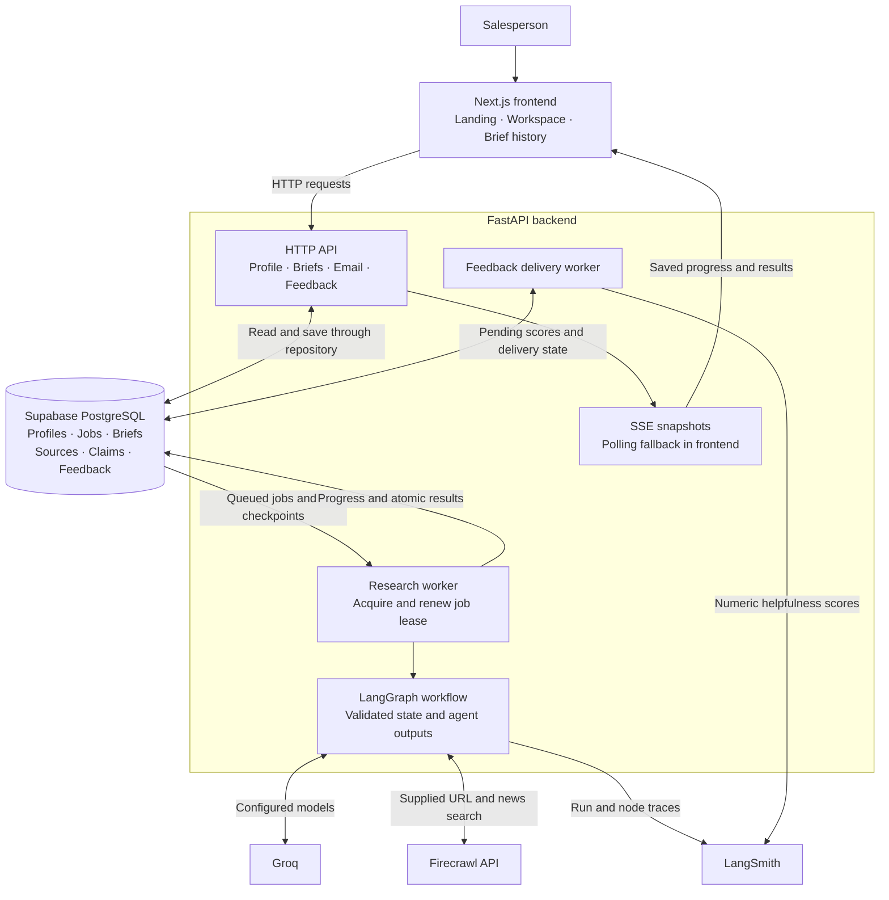
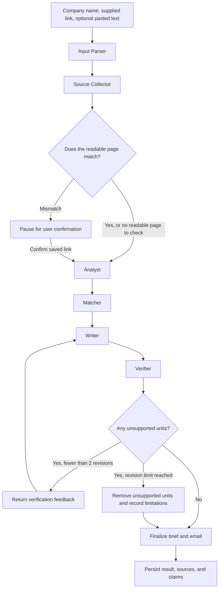

<p align="center">
  
  
  
  
  
  
  
  
  
  
  
  
  
  
</p>

# PitchPrep

**Research. Verify. Pitch.**

PitchPrep is a multi-agent sales research assistant for sales representatives, founders, and agencies preparing an outbound conversation. Give it a company name, a website or social link, and optional pasted information. It returns a prospect brief with source citations and an email draft you can review, edit, and copy.

The workflow separates research, analysis, matching, writing, and verification. Each retained brief claim carries source IDs, and a Verifier checks generated claims and email content against the collected excerpts. Thin evidence is called out explicitly, and statements still unsupported after the revision limit are removed.

This MVP is a **single-tenant demo**: the seller profile and brief history are shared. There are no user accounts, and emails are reviewed and sent by the user.

## Contents

- [Features](#features)
- [Architecture](#architecture)
- [Agent workflow and verification](#agent-workflow-and-verification)
- [Technology stack](#technology-stack)
- [Repository structure](#repository-structure)
- [Local setup](#local-setup)
- [Configuration](#configuration)
- [Using PitchPrep](#using-pitchprep)
- [API reference](#api-reference)
- [Persistence and job execution](#persistence-and-job-execution)
- [Tracing and feedback](#tracing-and-feedback)
- [Testing](#testing)
- [Current status and roadmap](#current-status-and-roadmap)
- [Troubleshooting](#troubleshooting)
- [Project documentation](#project-documentation)

## Features

| Feature | Behavior |
| --- | --- |
| Introductory landing page | Explains the product, pipeline, and verification process before opening the workspace |
| Seller profile | Saves what you sell and your ideal customer; editable for later briefs |
| Company research | Accepts one company name, its website or social link, and optional pasted information |
| Controlled source collection | Scrapes the exact supplied link and searches for recent news context |
| Live progress | Shows Parsing, Collecting, Analyzing, Matching, Writing, and Verifying through SSE, with polling recovery |
| Prospect brief | Organizes company facts, recent signals, likely needs, and suggested target roles |
| Visible evidence | Provides source citations, source excerpts, verification badges, and evidence limitations |
| Link confirmation | Pauses when a readable page appears to belong to another company |
| Thin-data handling | Uses available evidence and marks limitations when sources are blocked or incomplete |
| Email review | Supports subject/body editing, saving, copying, and regeneration in professional, friendly, or concise tones |
| Saved history | Persists briefs and progress so a run can be reopened after leaving the page |
| Feedback | Stores a helpfulness rating and optional comment, with background delivery of the numeric score to LangSmith |
| Responsive interface | Supports 360px layouts, keyboard navigation, visible focus, and reduced motion |

Batch imports, automatic email sending, CRM integrations, account management, named-contact scraping, and direct Google Maps scraping are outside the MVP scope. Google Maps listing text can be pasted into the context field.

## Architecture

The browser communicates with FastAPI. The backend owns provider credentials, database access, durable job execution, and the LangGraph workflow. Supabase stores both application data and the queue state; no separate message broker is required by the current implementation.



1. A submission saves a queued run and returns a brief ID immediately.
2. The worker acquires a database lease and executes the workflow outside the original HTTP request.
3. Stage updates and checkpoints are persisted as the run proceeds.
4. SSE sends saved snapshots to the browser; polling recovers when live updates are interrupted.
5. The final result, sources, and claims are saved in one database transaction.
6. The user can reopen the brief, save an email edit, request email regeneration, or leave feedback.

The worker starts with the FastAPI application lifecycle. One database lease permits one active run across backend processes. Closing a browser tab or SSE connection does not cancel research.

## Agent workflow and verification



The diagram shows the main research path. Unidentifiable pasted company data or a complete lack of usable sources ends in `needs_input`; unrecoverable provider failures end in `failed`.

| Stage | Responsibility | Model configuration |
| --- | --- | --- |
| Input Parser | Extracts structured company details from pasted text; uses the entered name directly when no text is pasted | `GROQ_MODEL_PARSER` |
| Source Collector | Collects the supplied page and news snippets, then selects excerpts that match the original source text | `GROQ_MODEL_SOURCE_COLLECTOR` |
| Link check | Uses a name match first, then a model assessment when needed; pauses for confirmation on a mismatch | `GROQ_MODEL_LINK_CHECK` |
| Analyst | Identifies potential trigger events and needs tied to source excerpts | `GROQ_MODEL_ANALYST` |
| Matcher | Connects those needs to the seller's offering and suggests target roles | `GROQ_MODEL_MATCHER` |
| Writer | Produces the brief and email using source IDs | `GROQ_MODEL_WRITER` |
| Verifier | Checks claims, the email subject, and email paragraphs against evidence | `GROQ_MODEL_VERIFIER` |

Model IDs are supplied through environment variables. The PRD's model choices describe the intended roles; the actual provider IDs and supported output modes must match the configured Groq models.

### Verification rules

- Pydantic validates model outputs and citation references.
- Pasted text is retained as a source labeled **user-provided**.
- Extracted evidence quotes must exist in the original source excerpt.
- A separate Verifier evaluates whether generated units are supported by those excerpts.
- Unsupported units return to the Writer for at most **two revision attempts**.
- Remaining unsupported units are removed, and the result records evidence limitations.
- Human email edits are saved separately and are clearly identified as not automatically verified.

Verification is still a model judgment. A quote existing in a source provides a structural check; it does not establish that the source is correct or that the model interpreted it accurately. The user should inspect the evidence before sending an email.

Email regeneration reuses saved evidence and runs **Writer and Verifier only**. It preserves the verified brief claims and avoids repeating source collection. The prior email remains available until regeneration succeeds.

## Technology stack

| Layer | Technology | Purpose |
| --- | --- | --- |
| Web application | Next.js App Router and React | Landing page, workflow screens, and saved brief views |
| Frontend language | TypeScript | Typed API contracts and components |
| Styling | Tailwind CSS and CSS variables | Responsive layouts, brand tokens, focus states, and motion |
| Typography | Outfit and Geist Mono through `next/font` | Brand typography and compact source labels |
| API | Python and FastAPI | Async routes, validation, application lifecycle, and streaming |
| Validation/configuration | Pydantic v2 and pydantic-settings | Structured outputs and environment-backed settings |
| Orchestration | LangGraph | Agent state, branches, resumable checkpoints, and bounded revisions |
| Model inference | Groq SDK | Configurable models for each workflow role |
| Web evidence | Firecrawl API through HTTPX | Scraping and recent-news search; no Firecrawl SDK is required |
| Persistence | Supabase PostgreSQL | Application data, transactional results, and durable job leases |
| Observability | LangSmith | Run/node tracing and helpfulness scores |
| Backend tests | pytest, pytest-asyncio, and HTTP mocks | Offline provider, workflow, API, and persistence-adapter checks |
| Browser tests | Playwright and axe-core | Mocked user journeys and automated accessibility checks |

Exact dependencies are recorded in [backend/requirements.txt](backend/requirements.txt), [frontend/package.json](frontend/package.json), and [frontend/package-lock.json](frontend/package-lock.json).

## Repository structure

```text
SalesBriefAssistant/
├── Readme.md                   # Repository overview and setup
├── AGENTS.md                   # Coding-agent rules and project constraints
├── skills-lock.json            # Installed skill references
├── .agents/skills/             # Installed agent skills
├── backend/
│   ├── .env.example            # Configuration names with blank values
│   ├── requirements.txt        # Pinned Python dependencies
│   ├── README.md               # Backend operation and retry settings
│   ├── app/
│   │   ├── main.py             # FastAPI factory and application lifecycle
│   │   ├── api/                # Health, profile, research, and review routes
│   │   ├── core/               # Settings and safe service errors
│   │   ├── schemas/            # Workflow, API, and persisted-record models
│   │   ├── services/           # Providers, repository, workers, retries, tracing
│   │   └── workflows/          # Research graph, prompts, verification helpers
│   ├── tests/                  # Offline backend tests
│   └── evals/                  # Reserved for the evaluation dataset and runner
├── frontend/
│   ├── .env.example            # Public backend-origin configuration
│   ├── README.md               # Frontend setup and browser testing
│   ├── src/
│   │   ├── app/                # App Router pages, metadata, and global styles
│   │   ├── components/         # Landing and workflow components
│   │   └── lib/                # Typed API client and source-link helpers
│   ├── scripts/                # Isolated browser-test build/server helper
│   └── tests/                  # Playwright journeys with intercepted APIs
├── supabase/migrations/        # Reserved for explicitly unapplied fallback SQL
└── docs/
    ├── Thumbnail.png           # README hero image
    ├── PRD.md                  # Product scope and acceptance criteria
    ├── DESIGN.md               # Brand and interaction specification
    ├── API.md                  # HTTP contracts and state transitions
    ├── DATABASE.md             # Schema, functions, grants, and leases
    ├── FRONTEND_REVIEW.md      # Design and verification record
    └── PitchPrep.mmd           # Planning diagram
```

## Local setup

### Prerequisites

- Node.js and npm. Local development has used **Node.js 22.20.0**.
- Python and `venv`. Local development has used **Python 3.11.9**.
- A development Supabase project with the PitchPrep tables and database functions provisioned.
- Groq and Firecrawl credentials for deliberate live research runs.
- LangSmith credentials if tracing is enabled.
- Installed Google Chrome for the browser suite, or Microsoft Edge via `PLAYWRIGHT_CHANNEL=msedge`.

The commands below use PowerShell from the repository root. Existing environments and dependencies can be reused.

### 1. Install backend dependencies

```powershell
Set-Location backend
python -m venv .venv
.\.venv\Scripts\python.exe -m pip install -r requirements.txt
Set-Location ..
```

On macOS/Linux, use `python3` to create the environment and `.venv/bin/python` for the virtual-environment commands.

### 2. Create local environment files

For a fresh checkout, copy the templates:

```powershell
Copy-Item backend/.env.example backend/.env
Copy-Item frontend/.env.example frontend/.env
```

Populate the local files using the [configuration reference](#configuration). Keep existing configured environment files when working in an already set up checkout. The example files intentionally contain names and blank values only.

### 3. Provision the development database

The existing development database was provisioned through Supabase MCP. Its schema and applied migration names are documented in [docs/DATABASE.md](docs/DATABASE.md).

A new, empty Supabase project needs the same tables, grants, and `pitchprep_*` functions before the application can use it. There is currently no checked-in bootstrap SQL script. Agent-performed database changes use Supabase MCP after confirming the development project; local migration SQL is a fallback only when MCP is unavailable.

### 4. Start FastAPI

In one terminal:

```powershell
Set-Location backend
.\.venv\Scripts\python.exe -m uvicorn app.main:create_app --factory --host 127.0.0.1 --port 8000
```

The API is available at `http://127.0.0.1:8000`. Interactive API documentation is at `http://127.0.0.1:8000/docs`, and `GET /api/health` checks local liveness without contacting model or scraping providers.

Starting FastAPI also starts the queue and feedback workers. Previously queued research jobs can execute once the server starts and use the configured provider quota.

### 5. Start Next.js

In a second terminal:

```powershell
Set-Location frontend
npm.cmd ci
npm.cmd run dev
```

Open `http://localhost:3000`. Use `NEXT_PUBLIC_API_BASE_URL` with the backend origin, such as `http://127.0.0.1:8000`, and set `FRONTEND_ORIGIN` to the exact browser origin, such as `http://localhost:3000`.

The frontend and backend are separate processes. `localhost` and `127.0.0.1` are different origins for CORS; use the origin that appears in your browser address bar.

## Configuration

### Frontend

| Variable | Purpose |
| --- | --- |
| `NEXT_PUBLIC_API_BASE_URL` | Backend HTTP(S) origin, without `/api`, another path, credentials, or query parameters |

The frontend appends `/api` itself. Next.js embeds this public value at build time, so restart development or rebuild production after changing it. Never put provider keys or a Supabase service-role key in a `NEXT_PUBLIC_*` variable.

### Backend

Settings are loaded from `backend/.env` through pydantic-settings.

| Variable | Purpose |
| --- | --- |
| `GROQ_API_KEY` | Groq credentials for model calls |
| `FIRECRAWL_API_KEY` | Firecrawl credentials for web collection |
| `FIRECRAWL_BASE_URL` | Firecrawl API base; the implementation uses the v2 API at `https://api.firecrawl.dev/v2` |
| `SUPABASE_URL` | Development project's Supabase API origin |
| `SUPABASE_SERVICE_ROLE_KEY` | Backend-only database credential |
| `FRONTEND_ORIGIN` | Exact frontend origin allowed by CORS |
| `LANGSMITH_PROJECT` | Project name used for workflow traces |
| `LANGSMITH_TRACING` | Enables tracing when set to `true`; defaults to disabled |
| `LANGSMITH_API_KEY` | Required when LangSmith tracing is enabled |
| `GROQ_MODEL_PARSER` | Input Parser model ID |
| `GROQ_MODEL_SOURCE_COLLECTOR` | Evidence-extraction model ID |
| `GROQ_MODEL_LINK_CHECK` | Company/link assessment model ID |
| `GROQ_MODEL_ANALYST` | Analysis model ID |
| `GROQ_MODEL_MATCHER` | Seller/need matching model ID |
| `GROQ_MODEL_WRITER` | Brief and email generation model ID |
| `GROQ_MODEL_VERIFIER` | Verification model ID |
| `GROQ_MODEL_EVAL_JUDGE` | Reserved evaluation-judge model ID; currently required by the settings schema |
| `WORKER_POLL_SECONDS` | Job-queue polling interval; default `2` |
| `WORKER_LEASE_SECONDS` | Worker lease lifetime; default `120` |
| `STREAM_POLL_SECONDS` | Backend SSE snapshot polling interval; default `1` |

Optional endpoint overrides and retry/concurrency settings are documented in [backend/README.md](backend/README.md). Provider calls use bounded exponential backoff and shared concurrency limits. Provider retries and schema-validation retries are separate bounded layers.

### Credentials and access

The browser accesses application data through FastAPI. RLS remains enabled in Supabase, and public database roles have no application table or function access. The backend service role holds the necessary grants.

The MVP has no application authentication. CORS restricts browser origins but does not authenticate callers. Deployment access controls must be decided before exposing the single-tenant demo publicly.

## Using PitchPrep

1. Open the landing page and select **Let's prep your pitch**.
2. Save what you sell and your ideal customer in the seller profile.
3. Enter the target company name and its website or social link.
4. Optionally paste listing details or other company information. This is particularly useful for businesses with blocked social pages or little web content.
5. Submit the company and watch the real stage updates.
6. If the link appears mismatched, confirm it explicitly or change the input.
7. Review the brief, follow its citations, and inspect any limited-data or evidence-limitations notes.
8. Edit and save the email, or regenerate it with a different tone. Copy it for your own review and sending.
9. Leave feedback and reopen the brief later from history.

The application retains input after a failed submission. Retrying unchanged input reuses its idempotency key; changing the input creates a new deliberate submission. Save email edits before regenerating to avoid replacing unsaved work.

## API reference

All routes below are served by the backend. Interactive schemas are available at `/docs` and `/openapi.json`.

| Method | Route | Purpose |
| --- | --- | --- |
| `GET` | `/api/health` | Local liveness check |
| `GET` | `/api/seller-profile` | Read the shared profile, or `null` before setup |
| `PUT` | `/api/seller-profile` | Save the seller's offering and ideal customer |
| `POST` | `/api/briefs` | Enqueue research; returns HTTP 202 with ID, status, and version |
| `GET` | `/api/briefs` | Read paginated brief history |
| `GET` | `/api/briefs/{id}` | Read input, progress, result, email edit, version, and errors |
| `GET` | `/api/briefs/{id}/stream` | Receive persisted snapshots through SSE |
| `POST` | `/api/briefs/{id}/confirm-link` | Confirm a mismatched link and enqueue continuation |
| `PUT` | `/api/briefs/{id}/email` | Save a human-edited email separately from the generated result |
| `POST` | `/api/briefs/{id}/email/regenerate` | Enqueue email-only regeneration using saved evidence |
| `POST` | `/api/briefs/{id}/feedback` | Save a rating and optional comment |

Creation supports an `Idempotency-Key` header. Link confirmation, email saving, and regeneration require `expected_version` to reject stale changes. Feedback ratings are `1` or `-1`.

Run statuses are `queued`, `running`, `needs_input`, `needs_confirmation`, `completed`, and `failed`. SSE events are `progress`, `result`, or `unavailable`; inspect the snapshot status because paused and failed runs also produce terminal `result` events.

See [docs/API.md](docs/API.md) for complete request behavior, version conflicts, reconnection semantics, pagination, and error responses.

## Persistence and job execution

| Table | Stores |
| --- | --- |
| `seller_profiles` | The shared seller profile |
| `briefs` | Inputs, seller snapshot, run state, checkpoints, progress, results, manual email edits, versions, leases, and trace identifiers |
| `sources` | Source IDs, origin types, URLs, excerpts, and collection timestamps |
| `claims` | Verified brief claims and their source references |
| `feedback` | The latest rating/comment per brief and durable LangSmith delivery state |

Database functions enforce job acquisition, lease ownership, atomic result persistence, and optimistic version checks. Expired or interrupted runs become failed rather than being automatically replayed against providers. Queued jobs remain durable across restarts.

Final persistence rejects claims that reference missing sources and rolls back the transaction if validation fails. Manual email edits remain separate from verified generated output. A failed email regeneration preserves the prior result and edit.

See [docs/DATABASE.md](docs/DATABASE.md) for grants, RLS, function behavior, and the applied migration history.

## Tracing and feedback

With tracing enabled, LangSmith records workflow and node spans. Trace inputs and outputs are hidden to avoid uploading pasted text, source bodies, and credentials through this tracing wrapper.

Feedback is persisted before delivery. A background worker sends the numeric rating under the `helpfulness` score key to the successful result's trace. Comments stay in Supabase. Failed deliveries remain pending, and durable event IDs support idempotent delivery.

Tracing and feedback-delivery behavior have offline coverage. A complete live-provider research run and live feedback-delivery check remain to be performed deliberately.

## Testing

Routine verification uses offline provider doubles and intercepted API responses. Live Groq and Firecrawl research or evaluation runs should be deliberate because they consume rate-limited quota.

### Backend tests

```powershell
Set-Location backend
.\.venv\Scripts\python.exe -m pytest -q
```

Backend tests cover schemas, retries, provider adapters, workflow branches, verification, API behavior, repository behavior, and feedback delivery. The test fixtures block outbound HTTP transports and disable LangSmith tracing. They do not require real provider credentials.

### Frontend checks

```powershell
Set-Location frontend
npm.cmd run lint
npm.cmd run build
npm.cmd run test:e2e
```

The browser suite builds a separate production bundle in `.next-e2e`, uses a fixed intercepted API origin, and serves it on port `3100`. It leaves the regular build and local environment file untouched. All API responses are synthetic, other external requests are blocked, and service workers are disabled.

Browser journeys exercise seller setup, submission recovery, link confirmation, stage progress, source links, email editing/copy/regeneration, feedback, and connection errors. Accessibility checks cover representative landing, input, and brief states; layout checks include 360px screens, reduced motion, and increased text size.

Next.js font compilation can require Google Fonts access during a clean build. This build-time dependency does not call Groq or Firecrawl. Google Chrome is the default browser; in PowerShell, use `$env:PLAYWRIGHT_CHANNEL = "msedge"` before running the suite to select Edge.

Test screenshots and failure traces are written to ignored `frontend/test-results/`. Automated accessibility checks do not replace a screen-reader or physical-device review. The detailed frontend verification record is in [docs/FRONTEND_REVIEW.md](docs/FRONTEND_REVIEW.md).

## Current status and roadmap

| Area | Current state |
| --- | --- |
| Schemas, settings, and FastAPI application | Implemented |
| LangGraph research pipeline and bounded verification loop | Implemented with offline coverage |
| Supabase persistence, access controls, and durable job execution | Provisioned in the existing development project; database behavior checked through MCP |
| Profile, brief, stream, confirmation, email, and feedback API | Implemented |
| Landing page and workflow interface | Implemented; lint, build, and mocked browser checks passed during the frontend phase |
| LangSmith trace and feedback wiring | Implemented; live end-to-end delivery remains unverified |
| Evaluation dataset and runner | Planned; `backend/evals/` is reserved for this work |
| Complete live Groq/Firecrawl workflow | Not yet verified |
| Deployment | Pending; frontend target is Vercel, backend hosting remains undecided between Render and Google Cloud Run |

The next product milestone is the evaluation dataset and runner. The PRD calls for 10–15 companies including social-only and thin-data cases, with groundedness, unsupported-claim rate, labeled Verifier precision/recall, relevance, personalization, cost, and latency measurements. These are evaluation goals, not published performance results.

Deployment configuration and operational documentation follow the evaluation phase. No production deployment or measured quality/latency claim is implied by the current implementation.

## Troubleshooting

| Symptom | Check |
| --- | --- |
| Workspace reports a configuration error | `NEXT_PUBLIC_API_BASE_URL` must be a valid HTTP(S) backend origin; restart/rebuild after updating it |
| Browser cannot reach the API | Confirm FastAPI is running and the public backend origin points to the correct host/port |
| CORS blocks a browser request | Match `FRONTEND_ORIGIN` to the exact frontend address, including host and port |
| Backend fails settings validation | Fill the required backend variables, including every `GROQ_MODEL_*` setting; tracing requires a LangSmith key when enabled |
| Database requests fail | Verify the development schema, RPC functions, backend credentials, and service-role grants documented in `docs/DATABASE.md` |
| Brief waits in the queue | Confirm the backend worker is running and can access the database; one active run is permitted at a time |
| Research pauses for confirmation | Review the submitted URL and explicitly confirm it, or submit corrected input |
| Social page is blocked or evidence is sparse | Paste usable company details; review the resulting limited-data note |
| Email save or regeneration returns a conflict | Refresh the brief to obtain the latest version, preserving any local edits before retrying |
| Build cannot fetch fonts | Allow access to Google Fonts during Next.js font compilation |
| Playwright cannot launch its browser | Install Chrome or select installed Edge through `PLAYWRIGHT_CHANNEL` |
| Restricted Windows runner hangs during browser-test teardown | Allow Playwright to stop its own local server process tree |

## Project documentation

| Document | Purpose |
| --- | --- |
| [Product requirements](docs/PRD.md) | Scope, user flow, agent responsibilities, acceptance criteria, and evaluation goals |
| [Design specification](docs/DESIGN.md) | Brand palette, typography, landing structure, component rules, and motion |
| [Backend guide](backend/README.md) | Backend startup, settings defaults, retry behavior, and offline testing |
| [Frontend guide](frontend/README.md) | Frontend configuration, screens, and browser verification |
| [API contracts](docs/API.md) | HTTP routes, payload behavior, state transitions, and SSE |
| [Database design](docs/DATABASE.md) | Tables, access controls, leases, functions, and migration history |
| [Frontend review](docs/FRONTEND_REVIEW.md) | Design decisions, checks performed, and verification limits |
| [Agent instructions](AGENTS.md) | Scope boundaries, development rules, skill use, and Supabase MCP workflow |

For agent-assisted development, read `docs/PRD.md` and `AGENTS.md` first. Keep changes reviewable, leave commits and pushes to the project owner unless a local commit is explicitly requested, and keep credentials out of code and documentation.
